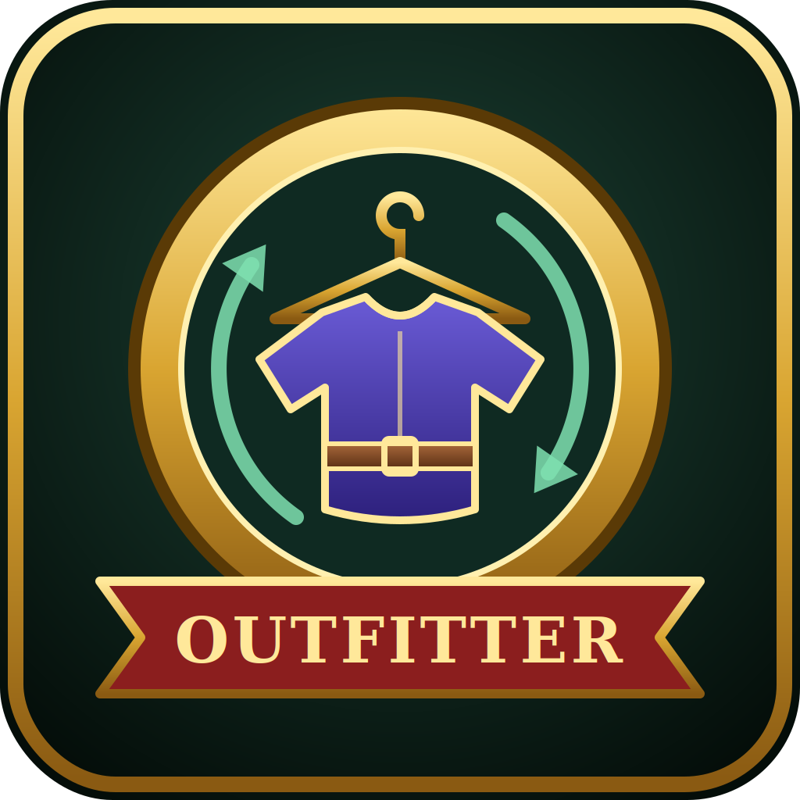

# Outfitter Forever

**Outfitter, ported to World of Warcraft: Forever.**

Outfitter Forever is an equipment management addon that gives you fast access to multiple outfits to optimize your abilities in PvE and PvP, automated equip and unequip for convenience doing a variety of activities, or to enhance role-playing.

It works like the Outfitter you know, with the same outfits, menus and scripts. It's based on [Outfitter (Retrofit)](https://www.curseforge.com/wow/addons/outfitter-retrofit) 5.5.4.3 by GovtGeek, which continues [Outfitter](https://www.curseforge.com/wow/addons/outfitter) by John Stephen (Mundocani). The changes are the ones Forever needs, plus its own name and logo.

---

## Features

- **Outfits.** Save any set of gear as an outfit and put it on with one click. **Complete outfits** replace everything you're wearing; **accessories** cover a few slots and go on top (fishing pole, Carrot on a Stick, ...).
- **Automatic outfits.** Give an outfit a script and it goes on and comes off by itself: riding, swimming, fishing, cooking, dining, cities, battlegrounds, dungeons, stances, forms, stealth, buffs, zones and more. Use the ready-made scripts or write your own.
- **Ready-made outfits.** On first use you get **Normal** (your current gear), a **Birthday Suit**, and empty outfits for your class's stances and forms.
- **Quick access.** A minimap menu, an optional outfit bar, key bindings, `/outfitter` commands for macros, and LibDataBroker.
- **Generate outfits** that maximize a stat or a mix of stats, or use your Pawn weights (needs Pawn).
- **Extras.** An icon picker, item tooltips that show which outfits use the item, and a title, helm and cloak setting for each outfit.
- **Works with Baganator.** With the Baganator bag addon, each outfit's gear gets its own group in your bags.

## On WoW: Forever

Outfitter Forever is fitted to Forever's game and its addon rules:

- **Classic gear and classes.** The ranged slot (bows, guns, wands, thrown, relics) is managed, warrior stance outfits follow your three stances, and scripts limited to a specialization use your talent trees.
- **The Equipment Manager tab opens Outfitter Forever.** It's the second tab at the top of your character window, and the Outfitter Forever window opens beside the window's tabs. With the stats pane collapsed, a small Outfitter button by the pane's arrow does the same. Untick **Use the Equipment Manager tab** in Options to get the game's Equipment Manager tab back and always use the small button.
- **Open the character window yourself.** An addon can't open it on Forever. "Open Outfitter Forever" works while it's open; otherwise you're asked to open it (`C`) and Outfitter Forever opens with it.
- **Health and mana are hidden from addons.** The Low Health / Low Mana outfit never changes your gear, Dining stays on until the food or drink buff ends, and Spirit regen counts any spell cast followed by a mana change as mana spent.
- **Buffs can't be read in combat.** Outfits that follow a buff (aspects, Ghost Wolf, Has Buff, ...) keep their state until combat ends.
- **Armor can't be changed in combat** (the game's rule). The outfit goes on as soon as combat ends.
- **Escape** closes the character window along with an open Outfitter Forever dialog.

## Installation

1. Download the latest release.
2. Unzip it into your WoW: Forever `Interface\AddOns` folder so you end up with an `AddOns\OutfitterForever\` folder.
3. Restart the game, or type `/reload` if it's already running.

Don't install another copy of Outfitter alongside it.

## Using it

- **Open Outfitter Forever.** Open your character window (`C`) and click the Outfitter Forever tab at the top (where the Equipment Manager tab was), or left-click the minimap button for the outfit menu.
- **Make an outfit.** Put on the gear, click **New Outfit**, and name it. Untick the slots the outfit shouldn't change.
- **Wear an outfit.** Click it in the Outfitter Forever window, the minimap menu or the outfit bar.
- **Keep an outfit up to date.** Gear you put on yourself stays on, but it isn't added to an outfit. To save what you're wearing into one (your **Normal** outfit as you level, say), open the menu to the right of the outfit and pick **Rebuild → Update to current items**.
- **Automatic outfits.** Use the menu to the right of an outfit to pick a script or turn it off.
- **Put outfits in your own order.** In the same menu, pick **Move up** or **Move down**. The order is saved for each character and is used in the list, the minimap menu and the outfit bar. **Sort this list by name** puts it back in A to Z order.

| Command | What it does |
|---|---|
| `/outfitter help` | Lists all the commands |
| `/outfitter wear Name` | Puts on the outfit |
| `/outfitter unwear Name` | Takes the outfit off |
| `/outfitter toggle Name` | Puts it on or takes it off |

## Feedback and bug reports

Found a bug or have an idea? Please [submit it on GitHub](https://github.com/severd8/outfitterforever/issues/new/choose). A short form asks for your class, the outfit or script involved and any error message. You'll need a free GitHub account. Otherwise, feel free to leave a comment on the CurseForge page.

## Support the addon

Outfitter Forever is free. If it has saved you some gear juggling, you can [leave a small tip on Ko-fi](https://ko-fi.com/tauntmasterforever). Thank you!

## Also by me

- **TauntMaster Forever**: one-click taunts off your healers and DPS, for tanks. Free on CurseForge.
- **ToppedOff Forever**: reminds you when buffs, food, reagents, ammo or gear need topping off. Free on CurseForge.
- **BattleText Forever**: scrolling combat text for your hits, heals and the damage you take. Free on CurseForge.

## Credits

- **John Stephen (Mundocani)**, who created Outfitter.
- **GovtGeek**, for Outfitter (Retrofit), and **Miv**, **Gogo** and **LemonDrake**, credited there.
- WoW: Forever port by **severd8**.

## License

MIT — see [LICENSE](LICENSE).
